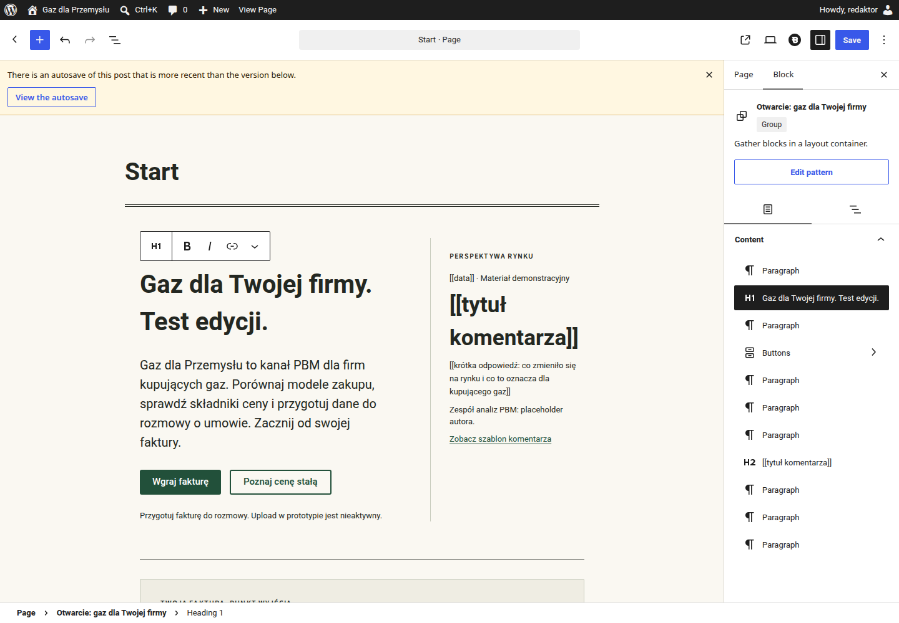
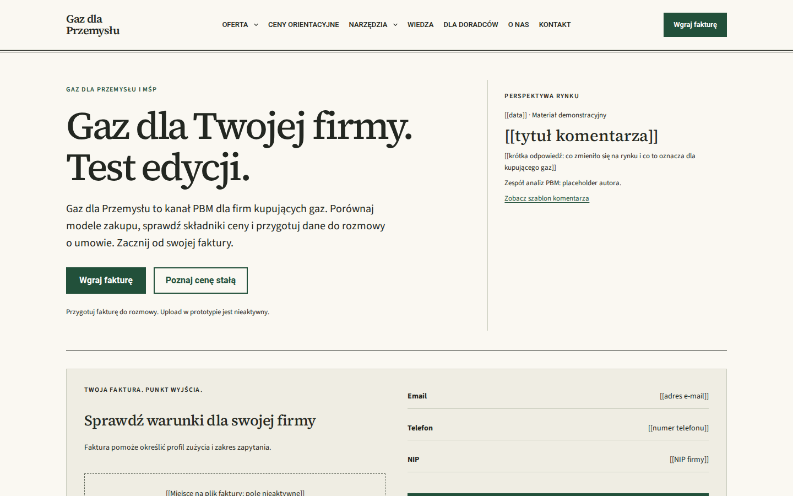
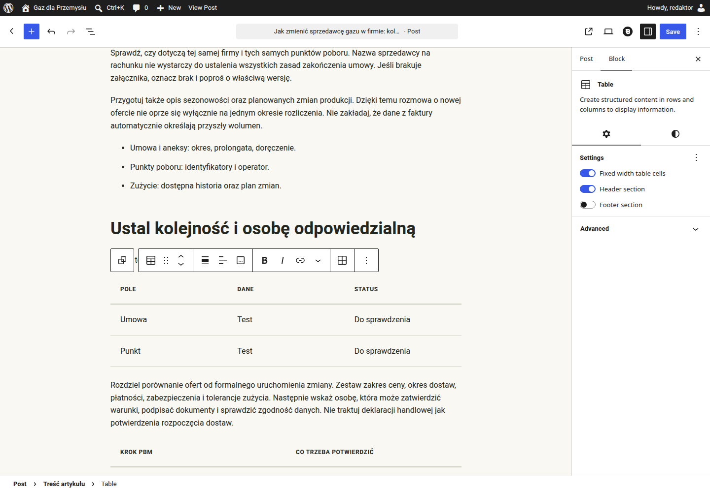
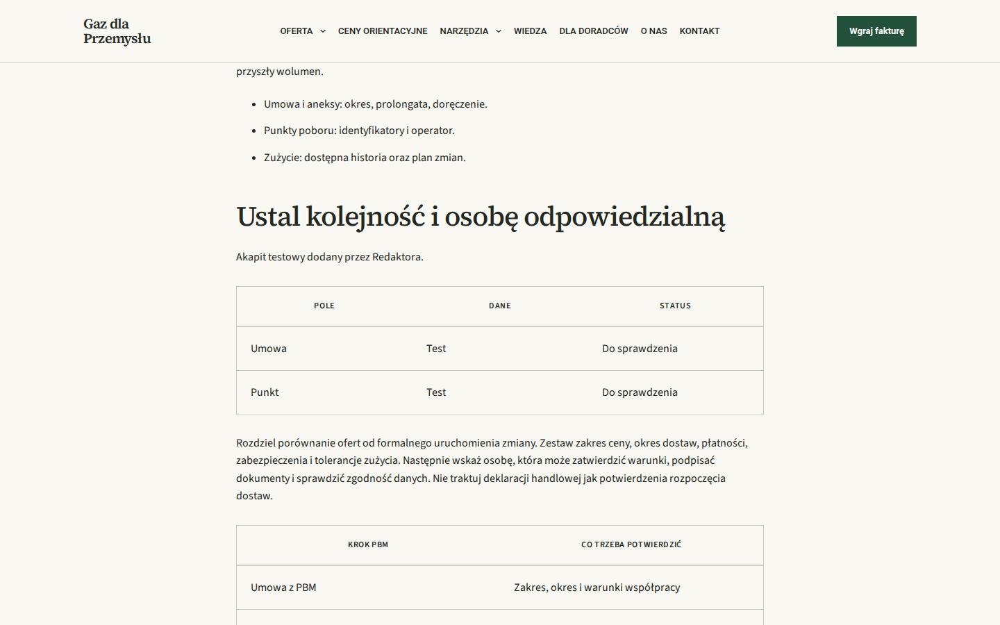
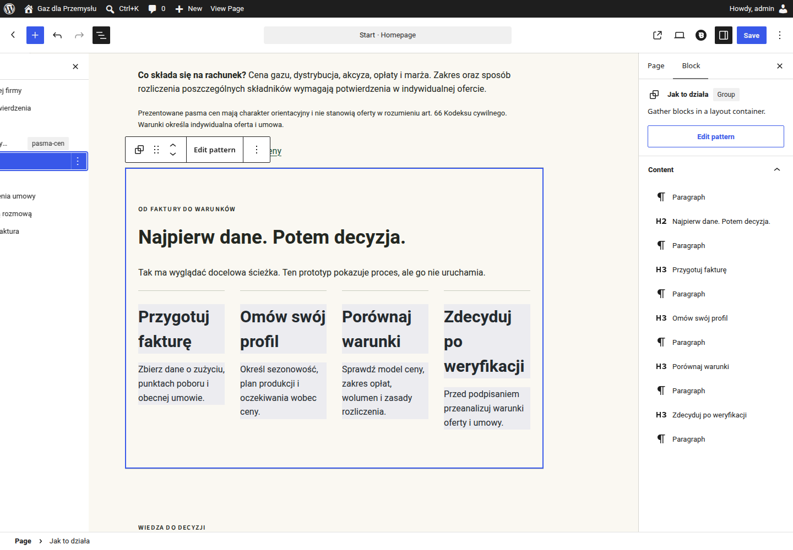
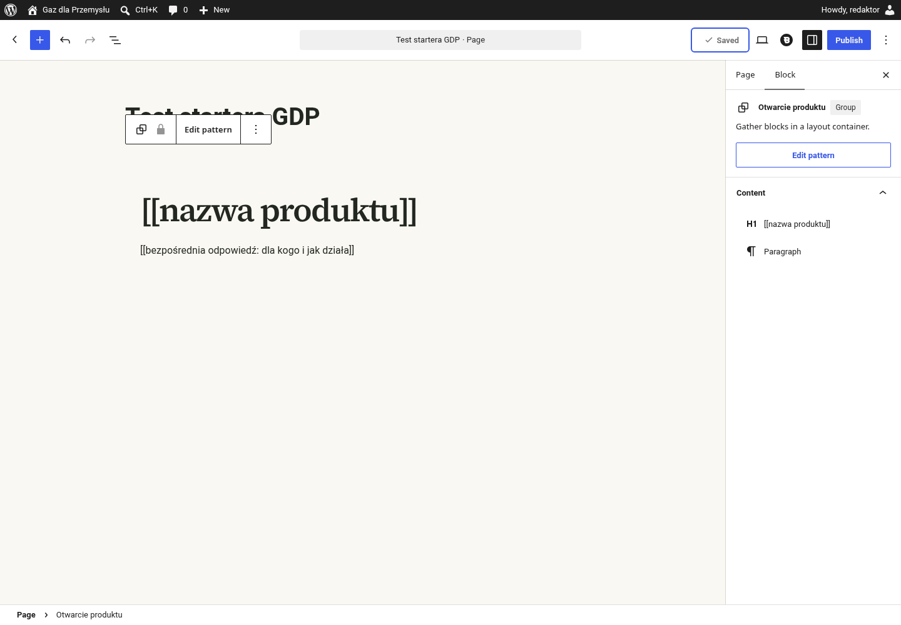

# P1.2 · Instrukcja testu edycji

Kierunek C, pakiet `etap1-v0.1`. Test wykonano lokalnie w WordPress Playground, na kontach prototypu, bez dostępu do infrastruktury PBM. Publiczny link Playground pozostaje niedostarczony; poniższa instrukcja nie oznacza zaliczenia tego wymagania.

## Przygotowanie

1. Po uruchomieniu właściwej instancji Playground otwórz jej `/wp-admin/`. To ścieżka wewnątrz tej samej instancji, nie panel domeny PBM.
2. Blueprint uruchamia konto Administratora. Wyloguj się przed próbą Redaktora.
3. Konto do testu: użytkownik `redaktor`, hasło `GDP-prototyp-2026`. Konto Administratora: `admin`, hasło `password`. To wyłącznie publiczne dane demonstracyjne.
4. Używaj jednego konta naraz. Zamknij kartę edycji przed zmianą konta. Jeśli WordPress pokaże blokadę współbieżnej edycji, wróć do listy stron i poczekaj na jej zwolnienie lub świadomie przejmij wpis przyciskiem „Take over”.

Interfejs administracyjny sprawdzonej instancji był angielski. Poniżej podano jego rzeczywiste etykiety z polskim objaśnieniem; nazwy sekcji i treść serwisu są polskie.

## Zmiana nagłówka strony głównej

Otwórz `Pages` (Strony), następnie `Start` i `Edit` (Edytuj). Nie wybieraj technicznego tytułu „Start” nad podglądem; edytuj nagłówek wewnątrz projektu.

1. Kliknij „Gaz dla Twojej firmy. Warunki pod kontrolą.” i wpisz własny tekst.
2. Kliknij `Save` (Zapisz) w prawym górnym rogu.
3. Kliknij `View Page` (Zobacz stronę) w górnym pasku i sprawdź efekt.

Te trzy kliknięcia dotyczą operacji po otwarciu edytora, nie logowania i przejścia przez listę stron. Nie trzeba odblokowywać sekcji ani wybierać ustawień układu.

W teście zapisano „Gaz dla Twojej firmy. Test edycji.” i sprawdzono ten tekst na froncie. W pakiecie źródłowym pozostaje oryginalny nagłówek.

## Dodanie akapitu i tabeli 3×3

Otwórz `Posts` (Wpisy) i artykuł „Jak zmienić sprzedawcę gazu w firmie: kolejność kroków i terminy”. Przewiń do drugiego nagłówka wewnątrz sekcji „Treść artykułu”: „Ustal kolejność i osobę odpowiedzialną”.

1. Kliknij na końcu tego nagłówka i naciśnij Enter. Powstanie akapit bezpośrednio pod nim.
2. Wpisz treść, naciśnij Enter, wpisz `/table` i zatwierdź Enterem po pojawieniu się `Table`.
3. Ustaw trzy kolumny oraz dwa wiersze danych i kliknij `Create Table`. W ustawieniach bloku włącz `Header section`: doda trzeci wiersz, będący nagłówkiem tabeli.
4. Wpisz etykiety trzech kolumn i zawartość sześciu komórek danych. Nie wybieraj kolorów, obramowania ani stylu.
5. Kliknij `Save`, następnie `View Post` (Zobacz wpis).

Tabela ma łącznie trzy wiersze i trzy kolumny. Nagłówek jest semantycznym `thead`; styl pochodzi z motywu, a na telefonie poziomo przewija się wyłącznie tabela.

W teście zapisano akapit oraz tabelę i sprawdzono ich kolejność, wymiar 3×3 i obecność `thead`. Wyjątek od `contentOnly` obejmuje wyłącznie sekcję „Treść artykułu”, aby ta wymagana operacja była możliwa; pozostałe sekcje zachowują blokady.

## Próba naruszenia układu

Jako Redaktor otwórz `Start` i kliknij `Document Overview` (Widok listy, przycisk obok cofania). Wybierz „Jak to działa”; nie powinno być dostępnego usuwania lub przesuwania całej sekcji ani przemieszczania kolumn w hero.

W testach WordPress zwrócił `canRemoveBlocks=false` i `canMoveBlocks=false` dla wszystkich dziewięciu sekcji strony głównej. Dodatkowa próba usunięcia sekcji przez standardowe API zapisu została odrzucona błędem `gdp_layout_locked`, HTTP 403.

Zakończ edycję i zaloguj się jako Administrator. Ponownie otwórz `Start`, zaznacz całą sekcję „Jak to działa” i kliknij strzałkę `Move down`; zapisz i sprawdź nową kolejność.

W teście sekcja została zapisana poniżej „Pasma cen orientacyjnych”, po czym przywrócono jej pozycję. Wnętrze nadal miało blokadę przesuwania; jego przebudowa wymaga świadomego odblokowania przez Administratora.

## Wzorce i nadpisania

- **Zastrzeżenie cen:** edytuj zsynchronizowany wzorzec, nie kopię tekstu na pojedynczej stronie. Test programowy zmiany wzorca potwierdził propagację na `/`, `/ceny-orientacyjne/` i do obu stopek; tekst testowy został wycofany.
- **FAQ produktu:** pytanie i odpowiedź mają osobne nadpisania. Test zapisu przez core REST API potwierdził wyrenderowanie obu zmienionych pól na stronie ceny stałej.
- **CTA:** nadpisywalne są nagłówek i podtytuł; link przycisku pozostaje stały. Oba pola sprawdzono na froncie i przywrócono treść oryginalną.

## Zakres potwierdzenia

Operacje zmiany nagłówka, dodania treści oraz przesunięcia sekcji przez Administratora wykonano w rzeczywistym interfejsie Gutenberg. Kontrolę blokad Redaktora uzupełniono odczytem stanu edytora i próbą zapisu przez REST; propagację i nadpisania sprawdzono programowo.

Wyniki maszynowe znajdują się w `qa/p12-editor.json` i `qa/p12-gutenberg.json`. Nie wykonano testu z udziałem zleceniodawcy ani testu publicznego linku; nie oznaczamy całego etapu 1 jako zaakceptowanego.

## Nowa strona ze startera

Wybierz dodawanie nowej strony, otwórz inserter bloków i kartę wzorców. Kategoria „Gaz dla Przemysłu” zawiera osiem starterów, między innymi „Otwarcie produktu”; gotowe grupy mają polskie nazwy i blokadę wnętrza.

Nowy, niezapisany szkic pozwala wstawić sekcje. Po pierwszym zapisie jako szkic Redaktor nie może już zmieniać ich kolejności; Administrator zachowuje tę możliwość.

Test odczytał osiem wzorców z API WordPressa, wstawił starter przez natywny mechanizm bloków i zapisał szkic przyciskiem interfejsu. Po zapisie potwierdzono `templateLock=all` i brak możliwości przesuwania; testowy szkic nie wchodzi do pakietu.
